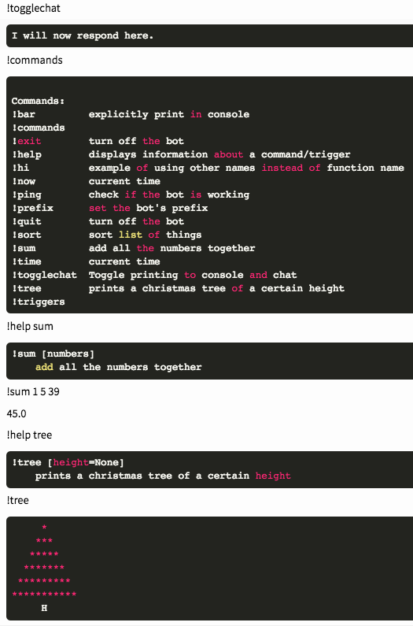

# basic-modular-gitter-bot
Quickly made example to show possible interesting projects kids can do during a bootcamp. Was never updated or used as we moved to Discord shortly after.

Put up to propose making chatbots or their modules as projects for 1st time programmers learning python.

Did a sweep through to clean it up a bit and make it work again, but It's still a mess, sorry.

Uses an edited gitterpy: https://github.com/graycatlabs/gitterpy



Example of how easy it is to add functionality to a bot made this way:

```py
@command()
def hug(msg):  # this command is triggered with !hug
    """gives someone a hug"""   # this becomes the !help description
    say(msg.upper())
```
